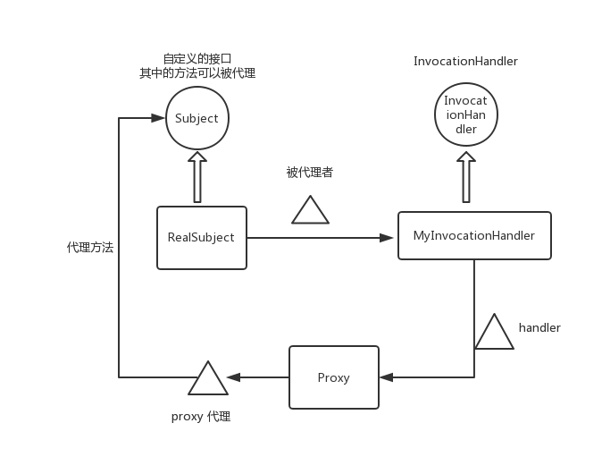

# Java 动态代理

#### 目标
+ 通过 java 反射来实现代理 `被代理者` 实现了的指定 `接口` 中的 `方法`
+ 通过给 `被代理者` 绑定一个 `动态代理的处理器`(实现InvocationHandler 接口), 生成一个处理器`handler`, 再将 `handler` 传递到Proxy类的静态方法 `newProxyInstance`中生成代理类对象 `proxy`, 最后通过 proxy 来间接调用 `被代理者` 中的方法, 从而实现 `AOP` 

#### 关键类和接口
+ 接口: InvocationHandler
+ 类: Proxy

#### 代码

```Java
// Subject.java

public interface Subject {
	void deal();
}
```

```Java
//RealSubject.java

public class RealSubject implements Subject{

	@Override
	public void deal() {
		System.out.println("finished a big deal!");
	}

}
```

```Java
//MyInvocationHandler.java

import java.lang.reflect.InvocationHandler;
import java.lang.reflect.Method;

public class MyInvocationHandler implements InvocationHandler{
	
	private Subject realSubject;
	
	public MyInvocationHandler(Subject realSubject2) {
		this.realSubject = realSubject2;
	}

	@Override
	public Object invoke(Object proxy, Method method, Object[] args) throws Throwable {
		//do something before invoke method
		System.out.println("before method: " + method.getName());
		
		//invoke method to finish business logic
		method.invoke(realSubject, args);
		
		//do something after invoke method
		System.out.println("after method: " + method.getName());
		return null;
	}
	
	//思考: 为什么没有用 proxy 参数, 如何进行代理的?
}
```

```Java
// Main.java

import java.lang.reflect.InvocationHandler;
import java.lang.reflect.Proxy;

public class Main {

	public static void main(String[] args) {
		//创建被代理的对象
		Subject realSubject = new RealSubject();
		//绑定到调用处理器
		InvocationHandler handler = new MyInvocationHandler(realSubject);
		//生成代理对象
		Subject proxy = (Subject) Proxy.newProxyInstance(handler.getClass().getClassLoader(),   //思考: 为什么要类加载器
				RealSubject.class.getInterfaces(), 
				handler);
		//通过代理对象调用被代理的接口方法
		proxy.deal();
	}
}

```


#### 动态代理简图以及说明
+ 圆形表示接口
+ 矩形表示类
+ 三角形表示对象



+ MyInvocationHandler 有2个任务
	+ 在构造函数中指定 `被代理者`, 也就是 RealSubject 的对象
	+ 重载 invoke 方法, 实现 AOP

+ 执行 `Subject proxy = (Subject) Proxy.newProxyInstance(handler.getClass().getClassLoader(), RealSubject.class.getInterfaces(), handler);` 来生成一个代理对象 proxy
+ `proxy` 之所以能被强制转换成 `Subject`, 是因为 `newProxyInstance` 的第二个参数, 被代理者实现了 `Subject` 接口, 所以 `proxy` 对象的的`类(在运行时生成)` 也会实现 `Subject` 接口, 所以可以强制转换.
+ 接下来就通过 proxy.[Subject接口中方法名] 就可以代理 `RealSubject` 中的方法了.


