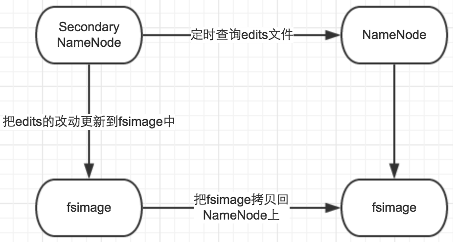

hadoop的Secondary NameNode
---

### NameNode
+ 主要用来保存HDFS的元数据信息, 如命名空间, 块信息等, 当它运行时, 这些信息会加载到内存中, 定期持久化到磁盘中
+ fsimage和editslog
	+ fsimage: NN启动时对整个文件系统的快照
	+ editslog: NN启动后, 对文件系统的改动序列, DN写触发
+ NN重启时读取fsimage, 并和editslog合并, 得到最新的快照
+ 存在的问题
	+ 由于生产环境 NN 很少重启, 所以edits会变得很大, fsimage的时间戳很旧
	+ NN重启需要合并fsimage和editslog, 重启时间会被拖长
	+ 如果NN宕机, 则会丢失很多改动

### Secondary NameNode
+ 也称为checkpoint node, 在HDFS中提供一个检查点, 实际是一个助手节点, 而不是NN的备份, 不能取代NN
 

+ 定时从NN获取edits, 并更新到fsimage上
+ 一旦由新的fsimage, 则将其拷贝到NN上, NN重启时则使用这个fsimage, 从而减少重启时间
+ 控制参数
	+ fs.checkpoint.period  指定2次检查点的最大时间间隔, 默认1h
	+ fs.checkpoint.size 指定edits日志文件的最大值, 一旦超过这个值会导致强制执行检查点, 默认64M

### 引用
> https://www.cnblogs.com/smartloli/p/4342340.html

