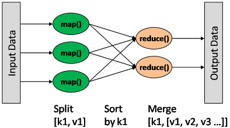
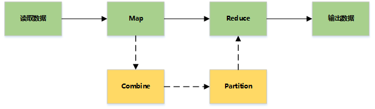
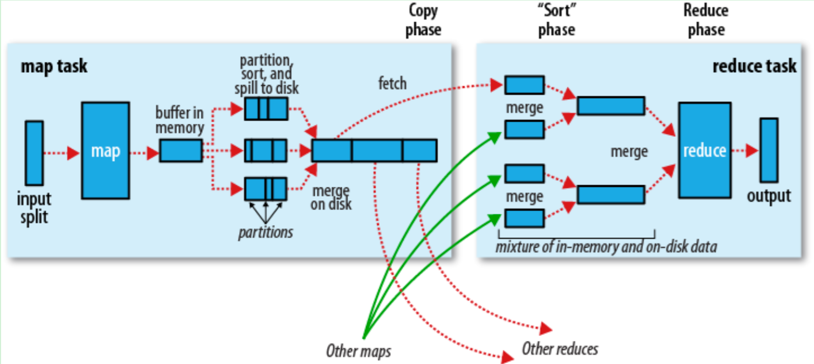

hadoop的mapreduce流程
---

### 简介
+ 一种分布式的计算方式, 指定一个map函数, 将一组键值对映射为一组新的键值对, 指定并发的reduce函数, 用来归约相同键的键值.

### 基本流程
+ 读取文件 --> Map --> Reduce --> 写结果

	+ combine  
		+ 分为map端和reduce端, 作用是将中间结果中相同key的kv对合并在一起, 便于减少网络传输, 可自定义, 默认不合并中间结果
		+ 通常map多,reduce少, 所以在reduce数据量大, 在map里面将数据归类, 这样到了reduce压力就轻了
		+ 例如: map为销售人员, reduce为销售经理, 如果销售人员不统计自己卖了多少件和多少钱, 那就需要销售经理统计, 为了减轻销售经理的压力, 那么这部分统计由 combine做就可以.
	+ partition
		+ 分割map每个节点的结果, 按照key分别映射给不同的reduce, 可以理解为归类, 默认使用hash, 可以自定义.
		+ 默认:  reducer = (key.hashCode() & Integer.MAX_VALUE) % numReduceTasks
		+ 这样可以将相同的key交给同一个reducer处理
	+ shuffle
		+ map端的shuffle
			+ spill溢写
				+ 每个map处理后的结果写入内存缓存区
				+ 对每一条kv进行分区
				+ 将相同分区的数据进行分区内排序
				+ 当内存缓存区写满后写入到磁盘
			+ merge合并: 将spill生成的小文件进行合并, 并排序
			+ 结束该map任务, 通知AM过来取数据
		+ reduce端的shuffle
			+ reduce启动多个线程, 通过网络到每台机器上拉取属于自己的数据
			+ merge合并: 
				+ 将每个map task中属于自己分区的数据进行合并
				+ 分区内排序
				+ 分组: 对相同key的value进行合并
				

### 详细流程

### 多节点下的流程

### 引用
> https://www.w3cschool.cn/hadoop/flxy1hdd.html

> https://blog.csdn.net/bfqiwbifj/article/details/51352059