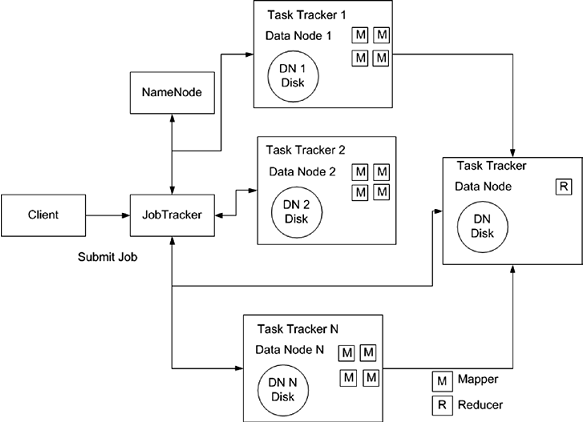

hadoop的体系架构
---

### Hadoop的2个核心组件
+ 分布式文件系统 HDFS
	+ 虚拟的文件系统, 在这个系统上创建了一个文件, 但实际上可能这个文件存放在多个物理机上, 看起来是在一台机器上.
+ 分布式编程模型 MapReduce
	
	+ 由3部分组成
		+ 编程模型
			+ 将问题抽象成Map和Reduce两个阶段, Map将输入数据解析成key/value
			+ 调用map()函数再以key/value的形式输出到本地目录
			+ reduce阶段将key相同的value进行规约处理, 并将最终结果写到HDFS上
		+ 数据处理引擎
			+ 由MapTask和ReduceTask组成, 分别负责Map和Reduce阶段的逻辑处理
		+ 运行时环境
			+ 由一个JobTracker(资源管理和作业监控)和多个TaskTracker(接收JobTracker的命令并执行)组成

### YARN (MapReduce 2.0)
+ 架构

	+ RM 和 NM 组成数据计算框架
		+ RM: 为系统中的应用(一个job或jobs的DAG)分配资源
			+ Scheduler: 根据它的知道的容量, 队列等限制将资源分配给运行中的不同的应用程序, 不负责跟踪和监控应用状态, 应用失败或硬件故障时不保证重启任务, 基于应用的资源需求而不是基于容器的整合资源执行调度功能. 通过插件可以按队列, 应用等资源拆分集群(?).
			+ AsM(ApplicationsMaster): 接收提交的作业. 协商应用指定的AM运行需要的容器, 提供重启该容器的服务.  然后AM从Scheduler申请容器资源, 并跟踪和监控申请到的容器的状态.
		+ NM: 每台机器上的框架代理, 职责是: 管理容器, 监控资源(CPU, 内存, 磁盘, 网络)使用情况, 然后报告给RM的Scheduler
	+ AM(应用级): 向RM申请资源, RM告诉AM哪些容器可以用, AM还需要找NM分配具体的容器. AM与NM交互来执行和监控具体的task(map/task).
	+ Container: 
		+ YARN框架的计算单元, 执行具体的task的基本单位, 一个节点运行多个Container, 一个Container不会跨节点.
	
+ 是一个通用的资源管理模块, 为各类应用程序提供资源管理和调度监控, 不仅限于MapReduce一种框架, 也可以服务于其他框架, 如: Tez, Spark, Storm等.
		
	

### HBase
+ 分布式, 面向列的开源非结构化数据库, 技术源于Google论文 "BigTable: 一个结构化数据的分布式存储系统"
+ Apache Hadoop的子项目

### ZooKeeper
+ 针对大型分布式系统的可靠协调系统, 提供: 配置维护, 命名服务, 分布式同步, 组服务等功能
+ 没有zk就无法部署HDFS的HA模式
+ Apache Hadoop的子项目

### Hive
+ 可以在Hive里建表, 通过表映射实际存储的Hadoop文件, 然后写sql去查询数据. Hive将输入的sql转为MapReduce任务去查询hadoop, 但是速度比较慢, 主要用于统计分析, 且支持sql的语法比较有限.

### Sqoop
+ 用于将hadoop和关系型数据库之间进行数据交换的工具. 通过hadoop的MapReduce导入导出, 有很高的并行性和良好的容错性.

### 引用
> https://blog.csdn.net/nsrainbow/article/details/36396007

