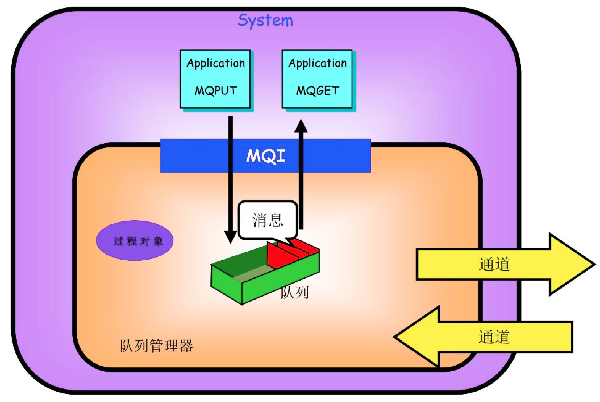
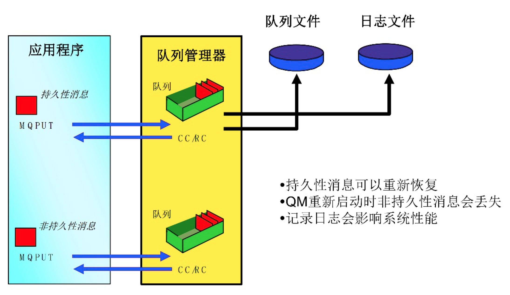

Kafka和IBM MQ比较
---
### 1. Kafka
#### 基本概念
+ *broker* 部署了kafka实例的服务器节点
+ *topic* 区分不同类型的消息的主题, 一个broker上可以有同一个topic的多个partition.
+ *partition* 每个topic可以有一个或多个分区(<=broker数量),一般每个broker上会有多个分区
+ *replica* 保证集群HA的数据副本, 一般一个partition在一个broker上只会有一个replica
+ *producer* 生产者, 往kafka集群写数据
+ *consumer* 消费者, 从kafka集群读数据
+ *consumer group* 消费者组, 包含一个或多个消费者, 每个topic消息只能被消费者组中的某一个消费者消费


#### 什么是ISR?
+ 每个partition中的leader维护的与其基本保持同步的replica列表
+ 当ISR中所有replica都向leader发送ack后, leader才commit
+ 由于producer往kafka中发送数据可以是批量的, 当ISR中某个follower比leader消息落后太多, 或者超过一定时间没有发起数据复制请求, 则leader将其移出ISR, 差距缩小后可以动态添加进来.

```sh
//server配置
replica.lag.time.max.ms=10000
replica.lag.max.messages=4000
//topic配置
min.insync.replicas=1  //每个ISR中至少有多少个replica
//producer配置
request.required.acks=0
    //0相当于异步, 不需要leader回复, 立即返回;
    //1表示leader收到消息后发送ack, 丢了会重发, 丢的概率小
    //-1挡所有的follower都同步消息成功后发送ack,丢失的概率更小
```

#### replica恢复
+ partition中的leader挂了之后, kafka使用zookeeper从它的follower中选举一个leader, 并将挂掉的leader从ISR中移除
+ 当该leader后面重新启动之后, 它知道自己之前的数据到哪里了,尝试取它挂掉之后leader处理的数据, 完成后加入ISR


#### 消息的写入和同步
+ 每个partition有一个leader和多个follower(replica), producer只会往leader写,然后leader写到replica.
	+ 同步复制: 所有follower复制完成后才commit,然后应答生产者--一致性好, 高可用差
	+ 异步复制: leader拿到数据之后应答或不用应答生产者,等follower慢慢复制--高可用,一致性差
+ kafka采用的是follower pull模式
+ kafka只保证在同一个partition内部消息是有序的, 不同的partition间不保证
+ 使用偏移量来标识一条数据, 消费者可以改变偏移量来读取想要的数据

#### 如何保证数据不重不漏
+ 消费端
	+ 重复消费: 建立去重表, 比如存在redis里面等
	+ 丢失数据: 关闭默认自动提交offset, 处理完之后再提交(不建议处理重逻辑)
+ 生产端
	+ 重复发送: 在消费端去重即可
	+ 丢失数据:
		+ 使用同步复制
		+ 使用异步复制通过ISR


### 2. IBM MQ
#### 什么是IBM MQ?
+ 基于SOA的组件或系统之间实现可靠数据传递的成熟系统
+ 保证消息不丢失和不重传
#### IBM MQ基本概念

+ *QMI* Queue Manager Interface
+ *通道* 通道是传递数据的关键, MQ Server之间的通道是单向的(一般成对出现,只发数据可以只用一个通道), MQ Server与应用之间的通达是双向的.
	+ 可以控制IP黑白名单, 过滤客户端连接
	+ 可以做授权,认证
+ *消息* 消息头+消息体
	+ 消息头是自定义的: message headers+message properties(为了对接其他一些监控系统等设置的), 其中properties是自定义的, 因此IBM MQ可以看做是一个私有协议.
	+ 最大长度100M, 默认4M(如果要修改, 收发双方配置都要修改)
	+ 可配置超时(1/10s为单位), 会扔到死信队列中
	+ 分为持久消息和非持久消息, 持久消息会写日志


#### IBM MQ工作原理
+ 消息服务基于队列
+ 队列采用存储转发机制, 实现可靠的数据传递
+ 采用成熟的数据库技术, 实现两阶段事务提交机制, 保证消息不被丢失或重新复制
+ 基于主题关键字的方式, 采用发布/订阅模式动态路由消息
+ 御用多处理器的线程技术和集群技术加速消息的吞吐量
+ MQ Sever之间是异步的, MQ Server与MQ app之间是同步的


#### 持久消息和非持久消息

+ 队列会建立对应的buffer, 持久消息会写log, 重启不丢失数据; 非持久消息只在内存, 不记日志
+ 消息有可以有优先级, 0-9 优先级递增

#### 队列的分类
+ *本地队列* 最常用
+ *传输队列* 特殊的本地队列, 用于在MQ Server之间传输数据, 如(招行->人行)
+ *远程队列* 是一个指针, 指向传输队列
+ *死信队列* 系统内部使用, 一般是因为收方有异常, 然后系统将消息放到死信队列中


### 3. 参考
> https://blog.csdn.net/qq_37502106/article/details/80271800

> https://www.jianshu.com/p/97011dab6c56