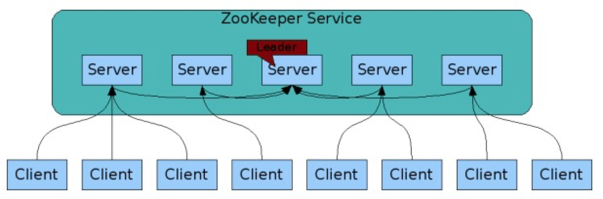

ZooKeeper学习笔记
---

### 什么是ZooKeeper
+ 高可靠分布式协同开源服务器

### znode
+ 用来使分布式进程系统协同工作的共享的数据注册的分层命名空间.
+ 类似文件系统的inode, 不同的是zookeeper提供高吞吐,低延时,高可靠,严格顺序访问的客户端, 来访问这些inode.
+ 除了`/`, 每个znode都有父znode, 不能删除有子节点的znode节点
+ 与文件系统的主要区别: 
	+ 每个znode都可以有数据
	+ znode会限制数据的大小, 默认1M. 因为本身zookeeper是用来存储协同数据的, 而不是用来作为大型存储系统.

### ZooKeeper架构

+ 服务由一群机器replica提供服务构成, 这些机器保存了一份带交易日志的数据树在内存镜像中, 并存了一份快照在存储系统.
+ server之间必须相互知道, 但大部分server可用则ZooKeeper可用; client必须知道所有的server,client可以创建一个句柄连接到server
+ 一个client只会连接到单个server, client通过发送请求, 获取响应, 获取监听事件和发送心跳来保持TCP连接, 如果TCP连接断掉了, 客户端将重新连到另一个server, 当首次连接到server时, server将为client建立会话, 如果客户端需要连接到其他server,会话将重新建立到新server上
+ client发送读请求时, 则由client连接的server处理, 如果读请求注册监听znode, 那也由这个server处理.
+ client发送写请求时, 将会被转发到其他server, 并进行一致性裁决, 然后生成响应. 同步请求也会转发到其他server, 但不会进行一致性裁决.
+ 顺序在zk中很重要, 所有的更新都是有序的, zk会在用数字在更新的时候表示顺序, 成为zxid(ZooKeeper Transaction Id), 每个更新会有一个唯一的zxid.

